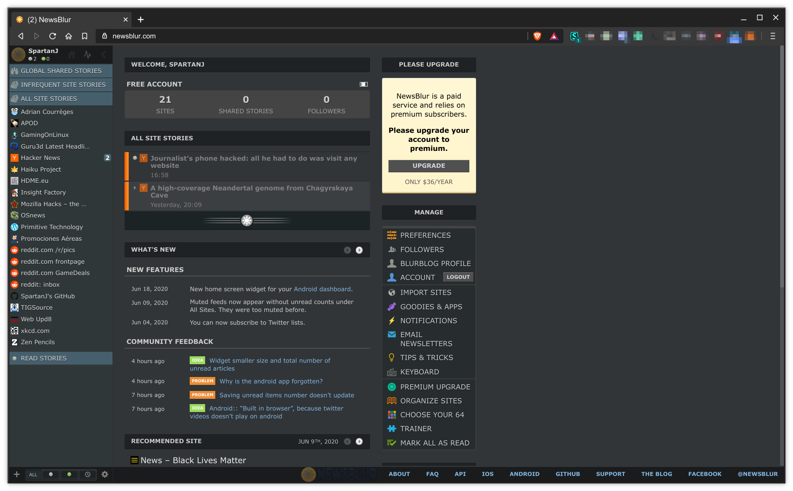

# NewsBlur Dark

NewsBlur dark is a simple dark style for [NewsBlur](https://newsblur.com).

## Preview

## Installation

Install [Stylus](https://add0n.com/stylus.html) for either 
[Firefox](https://addons.mozilla.org/en-US/firefox/addon/styl-us/), 
[Chrome/Chromium/Brave/Vivaldi](https://chrome.google.com/webstore/detail/stylus/clngdbkpkpeebahjckkjfobafhncgmne) or 
[Opera](https://addons.opera.com/en-gb/extensions/details/stylus/) or 
[Cascadea for Safari](https://cascadea.app/) and then:

[Install the usercss](https://raw.githubusercontent.com/SpartanJ/NewsBlur-Dark/master/newsblur-dark.user.css)
which supports automatic updates.

## Notes

This is a mirror of my style [NewsBlur Dark Theme by Prognoz](http://userstyles.org/styles/142911/)
hosted in [userstyles.org](https://userstyles.org). And this repository will now be the official
place to distribute the style, since userstyles is basically dead.

This is a fork from the flareback NewsBlur Dark version with some contrast issues fixed and some 
details changed to match my taste.

## License

[CC0 - Public Domain](https://creativecommons.org/share-your-work/public-domain/cc0/)
